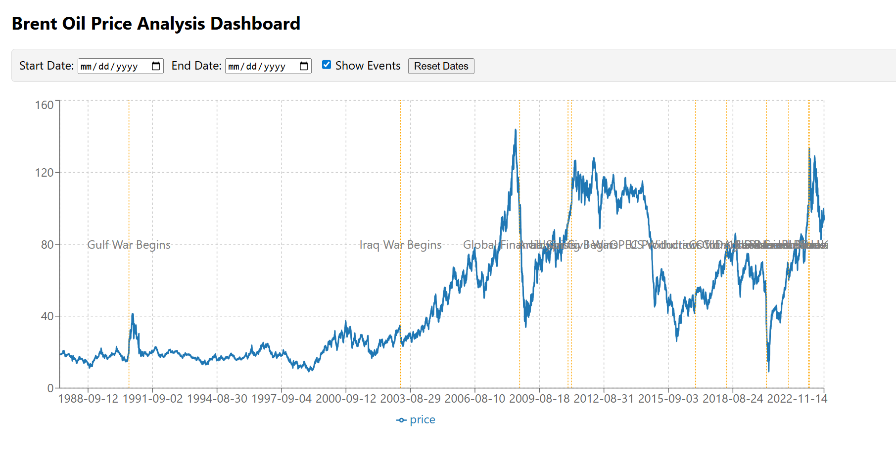
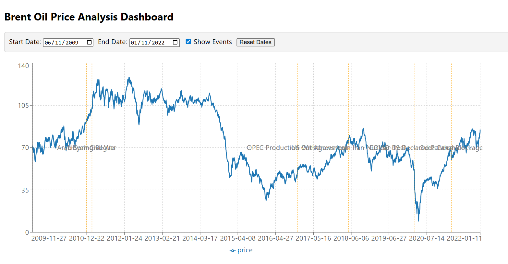

# Brent Oil Prices Change Point Analysis

## Project Overview
This project analyzes historical Brent oil prices to detect structural changes and link them to major geopolitical, OPEC, and macroeconomic events. Using exploratory data analysis (EDA), log returns, stationarity testing, and Bayesian change point detection, the analysis aims to provide actionable insights for investors, policymakers, and energy companies.

The core objectives are:

- Identify key events impacting Brent oil prices over the past decades.
- Quantify the effect of these events on price movements using statistical methods.
- Communicate insights through clear documentation and an interactive dashboard (planned).

---

## Repository Structure

``` bash
brent-oil-analysis/
│
├── data/
│   ├── raw/
│   │   └── BrentOilPrices.csv         # Historical Brent oil 
│   └── oil_market_events.csv      # Key geopolitical/
├── notebooks/
│   ├── task1_brent_analysis.ipynb  
├── reports/
│   └── task1_analysis_plan.md  # EDA of Brent prices and log returns
├── backend/ # Flask API for dashboard (future)
├── frontend/ # React dashboard (future)
├── requirements.txt # Python dependencies
├── README.md # Project overview and instructions
└── .gitignore # Files/folders to exclude from Git
```

## Data Sources
- **Brent Oil Prices:** Daily historical prices from May 20, 1987, to Sep 30, 2022.
- **Oil Market Events:** Curated dataset of geopolitical, OPEC, and macroeconomic events affecting the oil market.

> **Note:** The `data/` folder is excluded from version control due to size and privacy. Users should add the datasets manually.

---

## Environment Setup
1. Clone the repository:
   ```bash
   git clone <repo-url>
   cd brent-oil-analysis
2. Create and activate a virtual environment:
   ```bash 
   python -m venv env
   source env/bin/activate   # Linux/Mac
   .\env\Scripts\activate    # Windows 

3. Install Python dependencies:

   ```bash
   pip install -r requirements.txt
### Running Notebooks
1. Navigate to the notebooks/ folder.

2. Start Jupyter Notebook:
   ```bash
   jupyter notebook
3. Open task1_brent_analysis.ipynb to explore Task 1 analysis and initial EDA.

### Key Features
*   **Data Cleaning & Preprocessing:** Ensures reliable time series analysis.  
*   **Exploratory Data Analysis (EDA):** Visualizes price trends, volatility, and log returns. 
*   **Stationarity Testing:** ADF tests to check for mean/variance stability.
*   **Bayesian Change Point Detection:** Identifies structural breaks and quantifies uncertainty.   
*   **Event Association:** Compares detected change points with historical events for contextual interpretation.   
*   **Documentation & Communication:** Clear assumptions, limitations, and communication strategy for stakeholders.
### Future Components  
*   **Backend (Flask):** Serve processed data, change point results, and model outputs via API. 
*   **Frontend (React):** Interactive dashboard for visualizing trends, events, and detected change points. 
*   **Advanced Modeling:** Multi-change point detection, VAR models, and regime-switching extensions.

### Contributing
- Open GitHub issues for bugs, improvements, or feature requests.
- Keep exploratory work in notebooks/.
- Maintain reports and final deliverables in reports

Task 2: Change Point Modeling and Insight Generation
====================================================

Objective
---------

The objective of Task 2 is to apply **Bayesian change point detection** to identify and quantify structural breaks in Brent oil prices. The analysis aims to detect regime shifts in the price dynamics, quantify their impact, and relate detected changes to major geopolitical and economic events.

Data Description
----------------

*   **Dataset:** Brent crude oil prices    
*   **Frequency:** Daily data aggregated to **monthly averages**    
*   **Variables:**    
    *   Date: Observation date        
    *   Price: Brent oil price (USD)       

### Why Monthly Aggregation?
Monthly aggregation was applied to:
*   Reduce high-frequency noise    
*   Improve stationarity of returns    
*   Ensure computational feasibility of Bayesian change point inference with a discrete change point parameter   

This approach is standard in macroeconomic and energy market analysis.

Methodology
-----------
### 1\. Data Preparation and Exploratory Data Analysis (EDA)
*   Converted the Date column to datetime format and sorted the data chronologically    
*   Plotted the monthly Brent oil price series to identify long-term trends, shocks, and volatility    
*   rt=log⁡(Pt)−log⁡(Pt−1)r\_t = \\log(P\_t) - \\log(P\_{t-1})rt​=log(Pt​)−log(Pt−1​)    
*   Visualized log returns to observe volatility clustering and regime behavior  

### 2\. Bayesian Change Point Model
A Bayesian change point model was implemented using **PyMC** to detect a structural break in the mean of the return series.
#### Model Specification
*   **Change Point (τ):**    
    *   τ ~ DiscreteUniform(0, n−1)        
*   **Before and After Regimes:**    
    *   μ₁, μ₂ ~ Normal(0, σ)        
*   **Volatility:**
    *   σ ~ HalfNormal
*   **Switching Mechanism:**
    *   A hard switch using pm.math.switch assigns the appropriate mean depending on whether the time index is before or after τ
*   **Likelihood:**
    *   Returns are modeled using a Normal distribution
### 3\. Inference and Diagnostics
*   MCMC sampling performed using pm.sample() 
*   Convergence assessed using:
    *   Posterior summaries (r\_hat values)
    *   Trace plots
*   Posterior distribution of τ analyzed to determine the most probable change point
### 4\. Impact Quantification
*   Compared posterior means of μ₁ and μ₂
*   Quantified the magnitude of the regime shift as a percentage change in average log returns
*   Interpreted results probabilistically rather than causally
### 5\. Event Association
Detected change point dates were compared with a curated list of major oil market events, including:
*   OPEC production decisions
*   Global financial crises
*   Geopolitical conflicts
*   Pandemic-related demand shocks
Associations are presented as **hypotheses**, acknowledging that statistical change points do not prove causality.

Results
-------

*   The model identifies a statistically significant structural break in the Brent oil return series
*   The detected change corresponds to a notable shift in average returns
*   The timing aligns closely with major real-world oil market events, suggesting a plausible economic interpretation

Limitations
-----------

*   Monthly aggregation may smooth short-lived shocks  
*   The model assumes constant volatility across regimes
*   Change point detection identifies **correlation in time**, not causal impact

Conclusion
----------

Task 2 successfully demonstrates the application of Bayesian change point modeling to oil price data. The analysis provides interpretable insights into regime shifts in the Brent oil market and establishes a strong foundation for further multivariate or regime-switching extensions.

Files Included
--------------

*   Jupyter notebook with full analysis and visualizations
*   Posterior plots and diagnostics
*   Event comparison and interpretation

Absolutely! Here's a clear and professional **README** tailored for **Task 3: Developing an Interactive Dashboard for Data Analysis Results**. You can place this in the root of your project (e.g., README.md).

Task 3- Brent Oil Price Dashboard
==================================

Overview
--------

This project implements an **interactive dashboard** to visualize Brent oil price trends, detect structural changes, and explore correlations with major market events. The dashboard helps stakeholders analyze historical price movements and understand the impact of political decisions, conflicts, and economic sanctions on oil prices.

**Technologies Used:**
*   Backend: Flask (Python)
*   Frontend: React.js
*   Data visualization: Recharts
*   Data manipulation: Pandas, NumPy

Features
--------

### Historical Trends
*   View Brent oil price data over time.
*   Highlight structural breaks detected via change point analysis.
### Event Correlation

*   Visualize market events and their temporal proximity to significant price changes.
*   Option to toggle event markers on/off.
### Indicators
*   Display key indicators:
    
    *   Annualized volatility of Brent oil prices.  
    *   Average price change around major market events.       

### Interactive Filters

*   **Date range selection:** Filter both price data and events by start and end dates. 
*   **Event toggle:** Show or hide market events on the chart.
*   **Reset button:** Quickly restore full date range.

### Insights

*   Highlights significant change points with nearby events.  
*   Displays possible drivers of price movements in an insight box.

Project Structure
-----------------
```bash
brent-oil-change-point-analysis/
├─ backend/
│  ├─ app.py                # Flask backend serving APIs
│  ├─ requirements.txt      # Python dependencies
│  └─ data/
│     ├─ raw/
│     │  └─ BrentOilPrices.csv
│     └─ oil_market_events.csv
├─ frontend/
│  ├─ src/
│  │  ├─ components/
│  │  │  ├─ Dashboard.jsx
│  │  │  ├─ PriceChart.jsx
│  │  │  ├─ IndicatorCards.jsx
│  │  │  └─ InsightBox.jsx
│  │  └─ App.js
│  ├─ package.json
│  └─ public/
└─ README.md
```

Setup Instructions
------------------

### Backend (Flask)
1.  Navigate to the backend directory:

```bash 
cd backend
```

1.  Install Python dependencies:
```bash
pip install -r requirements.txt
```
1.  Run the Flask server:
```bash
python app.py
```
The backend API will be available at http://127.0.0.1:5000.

### Frontend (React)

1.  Navigate to the frontend directory:
```bash
cd frontend
```
1.  Install dependencies:
```bash
npm install
```
1.  Start the React development server:
```bash
npm start 
```

The dashboard will be available at http://localhost:3000.

API Endpoints
-------------

EndpointDescription/api/pricesReturns historical Brent oil price data/api/eventsReturns market events with date, category, and description/api/change-pointReturns the main detected change point/api/indicatorsReturns key indicators: volatility, average price change around events

Usage
-----

1.  Open the dashboard in a web browser: http://localhost:3000. 
2.  Use the **Start Date** and **End Date** filters to select a specific range.   
3.  Toggle **Show Events** to visualize or hide market events.
4.  Hover over the price chart to view exact price points.
5.  Review the **Insight Box** for key insights around change points.
6.  Review **Indicator Cards** for volatility and average price change metrics.

### Screenshots

**Dashboard Overview:**


**Indicator Cards and Insight Box:**


**Date Filters and Event Toggle:**

